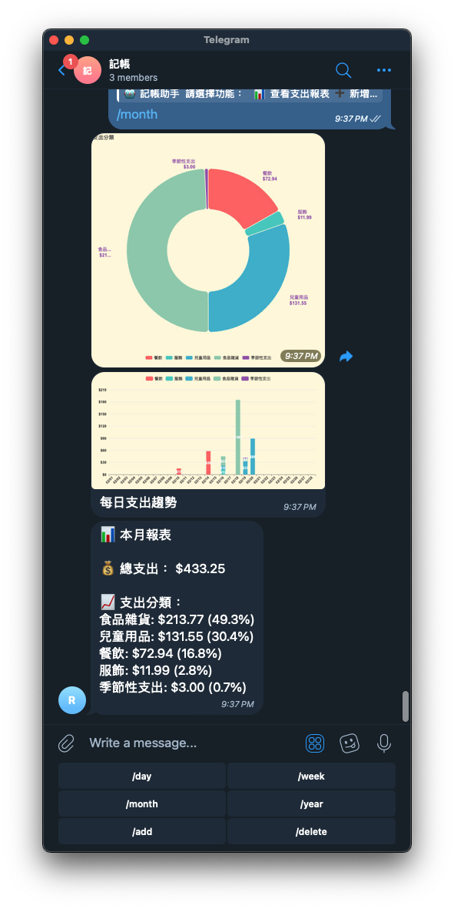

# Expense Tracker Bot

一個用於追蹤支出的 Telegram 機器人，支援多種報表和圖表，並且利用手機內建 AI 辨識保存收據。
(所有code皆為cursor ai產生)

## 尚需補足的功能
- /year 報表 recurring expense 只顯示一個月的金額
- 修改 recurring expense 的選單不見了
## 功能

- 📊 日報、週報、月報、年報
- 💰 支出分類統計
- 📈 趨勢圖表
- 💾 自動保存收據
- 🔄 固定支出管理

## 安裝

1. 克隆倉庫
2. 安裝依賴：`npm install`
3. 設置環境變數：
   - BOT_TOKEN
   - GROUP_ID
   - DATA_DIR (可選)
4. 運行：`npm start`

## 使用方法

1. 將機器人添加到群組
2. 發送 /start 或點擊主選單按鈕
3. 複製 Prompt 並貼給手機 AI 提示要產生的 JSON 格式，並拍下收據給 AI 辨識。
4. 將收據 JSON 分享給機器人，機器人會自動保存收據。
5. 選擇需要的功能：
   - 查看支出報表
   - 新增收據
   - 刪除記錄

## 授權

MIT
